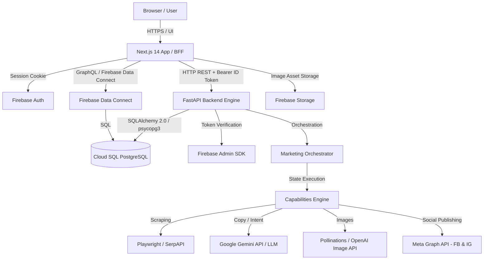
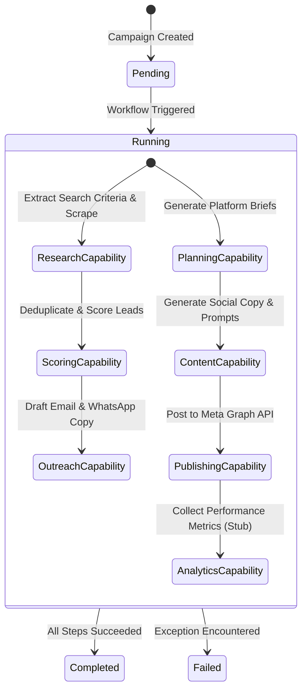
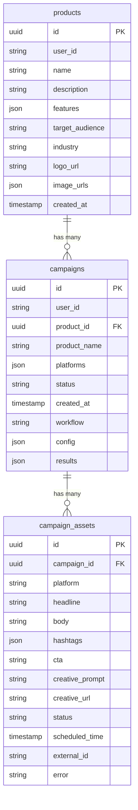
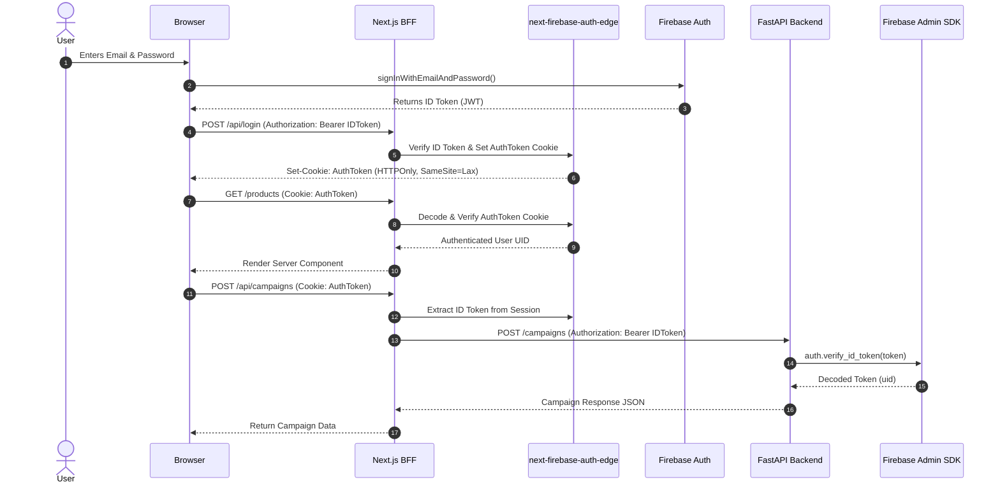
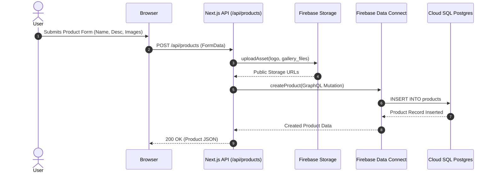
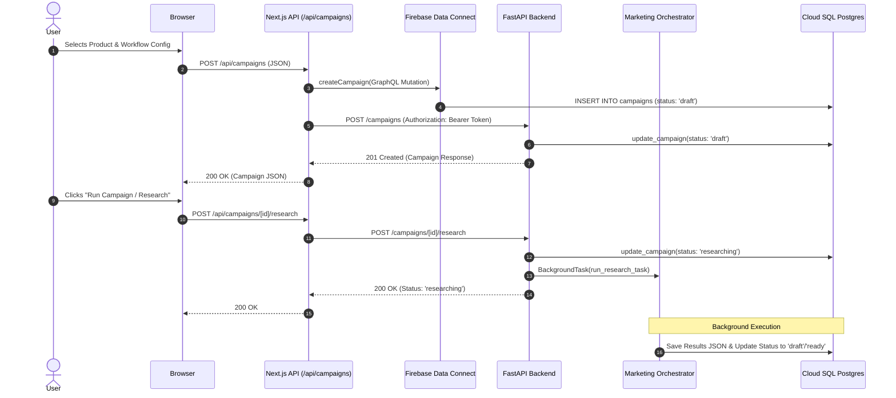
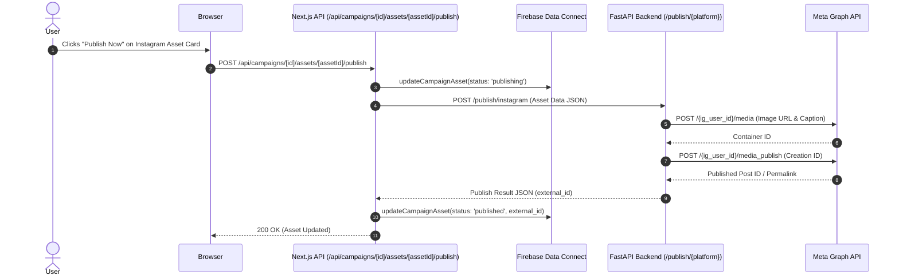

# PROJECT_ARCHITECTURE_REPORT.md
**Agentic Marketing Lead Engine — Complete Architectural Audit & Technical Reference**

---

## 1. Executive Summary

### What This Project Does
**Agentic Marketing** (Lead Engine) is an autonomous, multi-agent AI marketing system that automates end-to-end digital marketing and lead generation workflows. The system allows users to define products, perform market research and lead discovery, generate tailored social media copy and image creatives, publish posts directly to Meta platforms (Facebook Page and Instagram Business Account), and score/draft outreach messages for B2B leads.

### Primary Technologies
- **Frontend / BFF**: Next.js 14 (App Router, Server Components, TypeScript), React 18, TailwindCSS.
- **Backend Service**: FastAPI (Python 3.12), Uvicorn, Pydantic v2, Pydantic Settings.
- **Database & Data Access**:
  - **Firebase Data Connect**: GraphQL schema over Cloud SQL PostgreSQL (`dataconnect/schema/schema.gql`).
  - **SQLAlchemy 2.0 & psycopg 3**: Direct PostgreSQL ORM connection from FastAPI backend (`marketing_agent/services/storage/postgres_storage.py`).
- **Authentication**:
  - **Client & BFF**: Firebase Auth via `next-firebase-auth-edge` for session cookies (`middleware.ts`, `lib/auth.ts`).
  - **Backend**: Firebase Admin SDK (`firebase-admin`) verifying Bearer ID Tokens (`marketing_agent/api/auth.py`).
- **AI & ML**: Google Gemini API (`google-generativeai`, `gemini-2.5-flash`), OpenAI API, Anthropic Claude (configurable).
- **Creative Image Generation**: Pollinations.ai (default keyless API), OpenAI DALL-E/Image API, Stability AI.
- **Scraping & Research Subsystem**: Playwright (Chromium), SerpAPI, BeautifulSoup4 / HTTPX.
- **Storage**: Firebase Storage (via Firebase Admin SDK in Next.js API routes).

### Current Development Stage
- **Stage**: Advanced Prototype / Production-Ready MVP.
- **Status**: Core authentication, product management, campaign creation, lead generation workflows, SerpAPI research execution, local image generation, and Meta Facebook/Instagram publishing pipelines are operational. Analytics capability is a placeholder stub.

### Major Architectural Decisions
1. **Hybrid BFF + Decoupled Agent Service**: Next.js 14 acts as the user-facing app and BFF (Backend-For-Frontend), proxying workflow triggers and state synchronization to a Python FastAPI backend.
2. **Dual-Database Access Pattern to Single Postgres Storage**:
   - Next.js accesses Cloud SQL PostgreSQL via **Firebase Data Connect** (`@agentic-marketing/dataconnect` GraphQL client).
   - FastAPI accesses the exact same Cloud SQL PostgreSQL instance using **SQLAlchemy 2.0 + psycopg 3** (`ProductModel`, `CampaignModel`).
3. **Stateless Capability Orchestration**: The backend agent engine is structured into stateless `Capability` units (Research, Planning, Content, Publishing, Scoring, Outreach, Analytics) coordinated by an `Orchestrator` via an immutable-per-step `CampaignState`.
4. **Stateless Edge Auth with Firebase Token Validation**: HTTP requests to Next.js use signed `AuthToken` cookies verified by `next-firebase-auth-edge`. Proxied API calls to FastAPI pass the Firebase JWT as a `Bearer` token verified via `firebase_admin.auth.verify_id_token`.

---

## 2. Repository Structure

```
.
├── agentic-marketing-firebase-key.json    # Local Firebase Service Account Key (ignored in prod)
├── apps
│   └── web                                # Next.js 14 Web Application & BFF
│       ├── app                            # Next.js App Router (pages & API routes)
│       │   ├── api                        # Internal Next.js API Routes (BFF proxy)
│       │   │   ├── campaigns              # Campaign CRUD & execution triggers
│       │   │   └── products               # Product CRUD & image uploads
│       │   ├── campaigns                  # Campaign listing & detail dashboard pages
│       │   ├── login                      # Authentication page (SignIn/SignUp)
│       │   ├── products                   # Product listing, creation, campaign generator
│       │   ├── globals.css                # Global CSS styles & Tailwind directives
│       │   ├── layout.tsx                 # Root layout with HeaderAuth & styling
│       │   └── page.tsx                   # Landing / Root redirect page
│       ├── components                     # React UI Components
│       │   ├── CampaignDashboard.tsx      # Main campaign workspace (tabs, leads, assets)
│       │   ├── CustomCursor.tsx           # UI cursor enhancements
│       │   ├── ErrorBoundary.tsx          # React error boundary fallback
│       │   ├── GenerateForm.tsx           # Multi-step campaign creation wizard
│       │   ├── HeaderAuth.tsx             # Top navigation bar & logout handler
│       │   ├── InteractiveCanvas.tsx      # Decorative background canvas
│       │   └── MountLoader.tsx            # Client mount loading indicator
│       ├── lib                            # Core frontend utilities & integrations
│       │   ├── ai                         # Next.js-side LLM copy generation logic
│       │   ├── auth.ts                    # Edge-compatible Firebase token resolver
│       │   ├── backend.ts                 # HTTP client proxying calls to FastAPI
│       │   ├── creative                   # Pollinations / OpenAI image generation
│       │   ├── dataconnect                # Generated Firebase Data Connect JS SDK
│       │   ├── db                         # Data Connect repository layer (FdcRepo)
│       │   ├── firebase                   # Firebase Client & Admin SDK initializers
│       │   ├── storage                    # Firebase Storage upload handlers
│       │   └── types.ts                   # TypeScript interfaces & domain enums
│       ├── middleware.ts                  # Edge auth middleware (next-firebase-auth-edge)
│       ├── next.config.mjs                # Next.js configuration
│       ├── package.json                   # Web dependencies & build scripts
│       ├── test-fixtures                  # Client demo data fixtures & script helpers
│       └── tsconfig.json                  # TypeScript compiler settings
├── dataconnect                            # Firebase Data Connect Configuration
│   ├── connector                          # Connector definitions & GraphQL operations
│   │   ├── connector.yaml                 # JS SDK output target path settings
│   │   ├── mutations.gql                  # GraphQL mutations (insert/update)
│   │   └── queries.gql                    # GraphQL queries (get/list)
│   ├── dataconnect.yaml                   # Data Connect service definition & Cloud SQL link
│   └── schema                             # PostgreSQL schema definition
│       └── schema.gql                     # Product, Campaign, CampaignAsset GQL tables
├── docker                                 # Containerization & Deployment Configurations
│   ├── README.md                          # Container run instructions
│   ├── backend.Dockerfile                 # Python 3.12 + Playwright backend image build
│   ├── docker-compose.yml                 # Local multi-container compose file
│   └── frontend.Dockerfile                # Node 20 Next.js standalone image build
├── docs                                   # Documentation
│   ├── META_PUBLISHING.md                 # Meta Graph API setup & token reference
│   └── deployment.md                      # Railway & Cloud deployment instructions
├── examples                               # Utility & Demonstration Scripts
│   └── serpapi_demo.py                    # Standalone SerpAPI research workflow test script
├── firebase.json                          # Firebase CLI configuration (Data Connect, Storage)
├── marketing_agent                        # Python FastAPI Backend & Agent Subsystem
│   ├── api                                # FastAPI HTTP Layer
│   │   ├── auth.py                        # Firebase ID token verification dependency
│   │   ├── dependencies.py                # Shared FastAPI dependencies (Orchestrator, DB)
│   │   ├── main.py                        # FastAPI application factory & router registration
│   │   └── routes                         # REST Route Handlers
│   │       ├── campaigns.py               # Campaign execution & state endpoints
│   │       ├── health.py                  # Liveness and DB health checks
│   │       ├── leads.py                   # Lead discovery workflow endpoint
│   │       ├── publish.py                 # Meta Facebook/Instagram publisher endpoint
│   │       └── workflows.py               # Available workflow listing endpoint
│   ├── capabilities                       # Stateless Workflow Step Execution Units
│   │   ├── analytics.py                   # Analytics collection placeholder
│   │   ├── base.py                        # Abstract base class for capabilities
│   │   ├── content.py                     # Copy and prompt generation capability
│   │   ├── outreach.py                    # Email & WhatsApp draft capability
│   │   ├── planning.py                    # Platform brief planning capability
│   │   ├── publishing.py                  # Meta publisher execution capability
│   │   ├── research.py                    # Lead discovery & scraping capability
│   │   └── scoring.py                     # Lead fit scoring capability
│   ├── configs                            # Configuration Management
│   │   └── settings.py                    # Pydantic Settings reading .env variables
│   ├── core                               # Shared Core Utilities
│   │   ├── exceptions.py                  # Custom exception types
│   │   ├── logging.py                     # Logging format setup
│   │   └── utils                          # Phone normalization & string utils
│   ├── models                             # Pydantic & SQLAlchemy Models
│   │   ├── analytics.py                   # Analytics data models
│   │   ├── campaign.py                    # CampaignModel (SQLAlchemy) & CampaignResponse
│   │   ├── content.py                     # ContentAsset data model
│   │   ├── lead.py                        # Lead data model
│   │   ├── product.py                     # ProductModel (SQLAlchemy)
│   │   ├── publishing.py                  # PublishRequest & PublishResult
│   │   └── research.py                    # SearchCriteria model
│   ├── orchestrator.py                    # MarketingOrchestrator workflow registry
│   ├── services                           # External Service Integration Modules
│   │   ├── llm                            # Gemini / LLM integrations
│   │   ├── publishing                     # Meta Facebook & Instagram HTTP services
│   │   ├── scraper                        # Playwright & SerpAPI web scrapers
│   │   └── storage                        # SQLAlchemy Postgres session & CampaignRepository
│   ├── state.py                           # CampaignState container
│   └── workflows                          # Workflow Compositions
│       ├── base.py                        # Base Workflow execution logic
│       ├── content_only.py                # Plan → Content workflow
│       ├── lead_generation.py             # Research → Score → Outreach workflow
│       ├── organic_campaign.py            # Plan → Content → Publish workflow
│       └── performance_campaign.py        # Research → Plan → Content → Publish → Analytics
├── pyproject.toml                         # Python project definition & dependencies
├── railway.json                           # Railway deployment configuration
├── research                               # Independent Modular Market Research Subsystem
│   ├── execution                          # Execution safety (retry, timeout, concurrency)
│   ├── interfaces                         # Provider and store interfaces
│   ├── models                             # Context, intelligence & metadata models
│   ├── normalizers                        # Raw data to ResearchIntelligence transformers
│   ├── orchestrator                       # Workflow, executor, aggregator & registry
│   ├── providers                          # SerpAPI, Firecrawl, News, Reddit, Trends, Wappalyzer
│   └── tests                              # Unit tests for research workflow
├── results                                # Sample JSON outputs & generated campaign images
├── scripts                                # Utility Scripts
│   └── test_db_queries.py                 # Direct PostgreSQL query testing script
└── storage.rules                          # Firebase Storage Security Rules
```

### Major Directories Detailed
- `apps/web`: Next.js 14 web application providing authentication, UI dashboards, and BFF API endpoints.
- `marketing_agent`: Core Python backend package containing the FastAPI server, capability implementations, workflow registry, database repositories, and service integration wrappers.
- `research`: Autonomous research framework supporting concurrent provider execution, result aggregation, and data normalization.
- `dataconnect`: Firebase Data Connect service specifications, GraphQL schema, and connector definitions mapping to Cloud SQL PostgreSQL.
- `docker`: Production and local development Docker build manifests.

---

## 3. System Architecture

The overall system architecture consists of a Next.js 14 Frontend/BFF, a FastAPI Python Backend, Cloud SQL PostgreSQL accessed via Data Connect & SQLAlchemy, Firebase Auth, and external AI/Meta service providers.



---

## 4. Frontend Architecture

### Next.js App Router Structure
- `apps/web/app/layout.tsx`: Root HTML layout, applies `globals.css`, client-side `MountLoader`, custom cursor, and header auth state.
- `apps/web/app/page.tsx`: Root route, automatically redirects authenticated users to `/products` or unauthenticated users to `/login`.
- `apps/web/app/login/page.tsx`: Client-side login & sign-up page utilizing Firebase Client SDK (`signInWithEmailAndPassword`, `createUserWithEmailAndPassword`) and fetching `/api/login` to issue session cookies.
- `apps/web/app/products/page.tsx`: Server component listing all user products from `Repo.listProducts()`.
- `apps/web/app/products/new/page.tsx`: Product creation form handling multi-part form data uploads (logo, product gallery images).
- `apps/web/app/products/[id]/generate/page.tsx`: Multi-step campaign creation wizard component (`GenerateForm.tsx`).
- `apps/web/app/campaigns/page.tsx`: Server component listing user campaigns.
- `apps/web/app/campaigns/[id]/page.tsx`: Detailed campaign management workspace rendering `CampaignDashboard.tsx`.

### BFF API Routes (`apps/web/app/api/`)
- `api/products/route.ts`: `GET` lists products; `POST` accepts `formData`, uploads images to Firebase Storage, and calls `Repo.createProduct()`.
- `api/campaigns/route.ts`: `GET` lists campaigns; `POST` creates campaign resources locally via `Repo.createCampaign()` and initializes execution on the FastAPI backend via `backendClient.createCampaign()`.
- `api/campaigns/[id]/route.ts`: `GET` fetches campaign details and syncs status/results from the FastAPI backend if running `lead_generation`.
- `api/campaigns/[id]/research/route.ts`: `POST` triggers background research execution on the FastAPI backend via `backendClient.runCampaignResearch()`.
- `api/campaigns/[id]/assets/[assetId]/route.ts`: `PATCH` updates headline, body copy, hashtags, or CTA for a campaign asset.
- `api/campaigns/[id]/assets/[assetId]/creative/route.ts`: `POST` regenerates visual creative image for an asset using `generateCreative()`.
- `api/campaigns/[id]/assets/[assetId]/publish/route.ts`: `POST` proxies asset publishing requests to FastAPI backend `/publish/{platform}` endpoint and updates local asset status.

### Component Breakdown
- `HeaderAuth.tsx`: Top bar displaying authenticated user email and logout trigger.
- `GenerateForm.tsx`: Interactive wizard for selecting platforms, scrapers, locations, and campaign workflows.
- `CampaignDashboard.tsx`: Tabbed UI for reviewing SerpAPI research reports, generated social copy, lead match breakdowns, and publishing triggers.
- `ErrorBoundary.tsx`: React error boundary capturing component render failures.

### Database Integration & Data Connect Usage
- `apps/web/lib/db/repo.ts`: Interface `Repo` establishing database CRUD operations.
- `apps/web/lib/db/fdc-repo.ts`: Class `FdcRepo` implementing `Repo` using generated Firebase Data Connect SDK functions (`listProducts`, `getProduct`, `createProduct`, `listCampaigns`, `getCampaign`, `createCampaign`, `createCampaignAsset`, `updateCampaignStatus`, `updateCampaignResults`, `updateCampaignAsset`).

---

## 5. Backend Architecture

### FastAPI Framework & Router Configuration
The FastAPI backend (`marketing_agent/api/main.py`) exposes modular REST endpoints configured via Pydantic settings:
- `/health`: Liveness probe (`marketing_agent/api/routes/health.py`).
- `/health/db`: Non-blocking threadpool database connectivity and latency test.
- `/campaigns`: REST endpoints for creating, retrieving, patching, and triggering campaigns (`marketing_agent/api/routes/campaigns.py`).
- `/leads`: REST endpoint for executing the standalone `lead_generation` workflow (`marketing_agent/api/routes/leads.py`).
- `/workflows`: Metadata endpoint listing available workflows (`marketing_agent/api/routes/workflows.py`).
- `/publish/{platform}`: Publishing gateway endpoint (`marketing_agent/api/routes/publish.py`).

### Key Modules & Responsibilities
- `marketing_agent/orchestrator.py`: `MarketingOrchestrator` maintains a registry of workflow names mapped to `Workflow` objects.
- `marketing_agent/state.py`: `CampaignState` model acting as the single mutable context object passed sequentially through capabilities.
- `marketing_agent/services/storage/postgres_storage.py`: Initializes SQLAlchemy `Engine` (`postgresql+psycopg://`) with connection pooling and exposes `get_session()`.
- `marketing_agent/services/storage/campaign_repository.py`: `CampaignRepository` handles database persistence for `CampaignModel`.

### Backend Modules Matrix

| Module | Responsibility | Inputs | Outputs |
| :--- | :--- | :--- | :--- |
| `api.routes.campaigns` | Campaign resource state management & execution queuing | HTTP JSON requests, Bearer ID Token | `CampaignResponse` JSON |
| `api.routes.publish` | Platform publishing proxy | `PublishBody` JSON | `PublishResult` dict |
| `orchestrator.MarketingOrchestrator` | Workflow lookup & execution dispatch | `workflow_name`, `CampaignState` | Updated `CampaignState` |
| `workflows.base.Workflow` | Sequential execution of capabilities | `CampaignState` | `CampaignState` |
| `services.storage.CampaignRepository` | ORM queries & transactions for campaigns | `campaign_id`, patch dicts | `CampaignModel` instance |

---

## 6. AI Agent Architecture

### Campaign Execution & State Flow
All backend operations revolve around passing `CampaignState` through an ordered list of `Capability` steps. Every capability reads from `CampaignState`, performs its operation, appends logs/errors, and returns the updated `CampaignState`.



### Capabilities Overview
1. **`ResearchCapability`**: Extracts search criteria from product description using LLM, runs configured scrapers (`serpapi_google`, `google_maps`, etc.) concurrently, deduplicates leads, and generates a 2-sentence lead summary.
2. **`ScoringCapability`**: Evaluates leads (0-100 fit score) using LLM batch scoring or heuristic data factors (phone, email, website, rating, location fit).
3. **`OutreachCapability`**: Generates personalized B2B outreach copy (Email and WhatsApp) for each lead and generates target ad images.
4. **`PlanningCapability`**: Prompts LLM to create per-platform content briefs (headline direction, tone, key message).
5. **`ContentCapability`**: Generates social post copy (headline, body, hashtags, CTA, creative prompt) for each targeted platform.
6. **`PublishingCapability`**: Calls registered `PublisherService` implementations to post assets to external APIs.
7. **`AnalyticsCapability`**: Placeholder for collecting engagement metrics.

---

## 7. Database Architecture

### Data Models & Tables
The application relies on Cloud SQL PostgreSQL with two distinct access methods sharing the same tables:



### Table Ownership & Data Usage
- **`products`**: Stores product metadata, target audiences, features (JSON array), logo URLs, and image URLs. Created & read by Next.js Data Connect and Python backend ORM (`ProductModel`).
- **`campaigns`**: Stores campaign state, workflow configuration (`config` JSON), and execution outputs (`results` JSON). Created & read by Next.js Data Connect and updated by Python backend ORM (`CampaignModel`).
- **`campaign_assets`**: Stores individual social media posts and creative URLs. Managed by Next.js Data Connect (`FdcRepo`); Python backend stores assets inside `campaigns.results` JSON when executing backend-only workflows.

---

## 8. Authentication

### Authentication Flow
Authentication is managed via Firebase Auth across both Next.js and FastAPI.



---

## 9. Firebase Architecture

### Firebase Integration Components
1. **Firebase Client SDK (`apps/web/lib/firebase/client.ts`)**: Used in the browser for user login (`getAuth()`) and accessing Firebase Storage.
2. **Firebase Admin SDK**:
   - Next.js (`apps/web/lib/firebase/admin.ts`): Server-side bucket management and asset upload (`uploadAsset`).
   - FastAPI (`marketing_agent/api/auth.py`): Verifies Firebase ID Tokens (`auth.verify_id_token`).
3. **Firebase Data Connect (`dataconnect/`)**: Maps GraphQL schemas to Cloud SQL PostgreSQL. Generates TypeScript SDK in `apps/web/lib/dataconnect`.
4. **Firebase Storage (`storage.rules`)**: Stores uploaded product logos, gallery images, and generated creative assets.

### Implementation Status Matrix

| Component | Status | Details |
| :--- | :--- | :--- |
| Firebase Auth Client | Implemented | Email/Password login & signup |
| Firebase Auth Edge Middleware | Implemented | Cookie-based session management (`next-firebase-auth-edge`) |
| Firebase Admin ID Verification | Implemented | FastAPI `get_current_user` dependency |
| Firebase Data Connect Queries/Mutations | Implemented | `Product`, `Campaign`, `CampaignAsset` GraphQL schema |
| Firebase Storage Asset Uploads | Implemented | Public asset uploads via `firebase-admin/storage` |
| Firestore / Realtime DB | Deprecated | Replaced by Firebase Data Connect + Cloud SQL PostgreSQL |

---

## 10. External Services

- **Google Gemini API (`google-generativeai`)**: Primary LLM for intent extraction, copy generation, lead scoring, and outreach drafting (`gemini-2.5-flash`).
- **SerpAPI**: Google Search & Local Maps scraping for B2B lead discovery (`research/providers/serpapi.py`, `marketing_agent/services/scraper/serpapi_google.py`).
- **Meta Graph API (`v21.0`)**: Facebook Page photo publishing (`POST /{page_id}/photos`) and Instagram Business media container creation & publishing (`POST /{ig_user_id}/media`).
- **Pollinations.ai**: Default keyless image generation service for social media creative visuals (`https://image.pollinations.ai/prompt`).
- **OpenAI API / Stability AI**: Optional paid providers for copy generation (`gpt-4o-mini`) and image generation (`dall-e-3` / `stable-image`).
- **Firebase / Cloud SQL PostgreSQL**: Authentication, asset storage, and relational database backend.
- **Railway / Vercel**: Deployment hosting platforms for backend Docker containers and frontend web app.

---

## 11. End-to-End Request Flows

### Product Creation



### Campaign Creation & Execution Flow



### Social Media Publishing Flow



---

## 12. Configuration

### Environment Variables

| Variable Name | Group | Purpose | Secret? |
| :--- | :--- | :--- | :--- |
| `NEXT_PUBLIC_APP_URL` | Frontend | Base URL of Next.js frontend | No |
| `BACKEND_API_URL` | Frontend / BFF | URL of Python FastAPI backend | No |
| `AI_PROVIDER` | Backend / AI | LLM provider selection (`gemini`, `openai`, `anthropic`, `demo`) | No |
| `AI_PROVIDER_API_KEY` | Backend / AI | API key for configured LLM provider | **Yes** |
| `AI_MODEL` | Backend / AI | Specific model name (e.g. `gemini-2.5-flash`) | No |
| `GEMINI_API_KEY` | Backend / AI | Fallback Gemini API key | **Yes** |
| `CREATIVE_PROVIDER` | Backend / AI | Image generation provider (`pollinations`, `openai`, `stability`) | No |
| `CREATIVE_PROVIDER_API_KEY` | Backend / AI | API key for paid image generation services | **Yes** |
| `META_GRAPH_VERSION` | Meta Publishing | Graph API version (default `v21.0`) | No |
| `META_ACCESS_TOKEN` | Meta Publishing | Facebook Page Access Token | **Yes** |
| `INSTAGRAM_ACCESS_TOKEN` | Meta Publishing | Instagram User Access Token | **Yes** |
| `META_PAGE_ID` | Meta Publishing | Numeric Facebook Page ID | No |
| `META_IG_USER_ID` | Meta Publishing | Numeric Instagram Business Account ID | No |
| `FIREBASE_PROJECT_ID` | Firebase | Firebase Project ID (`agentic-marketing-3e4ca`) | No |
| `FIREBASE_CLIENT_EMAIL` | Firebase | Service account client email | No |
| `FIREBASE_PRIVATE_KEY` | Firebase | Service account private key | **Yes** |
| `GOOGLE_APPLICATION_CREDENTIALS` | Firebase | Path to service account JSON key file | No |
| `DATABASE_URL` | Database | PostgreSQL connection string (`postgresql+psycopg://...`) | **Yes** |
| `SERPAPI_API_KEY` | Scrapers | SerpAPI key for Google Search/Maps lead discovery | **Yes** |
| `SCRAPER_HEADLESS` | Scrapers | Toggle Playwright headless browser mode (`true`/`false`) | No |
| `REDIS_URL` | Backend | Redis URL for caching/queues | No |
| `LOG_LEVEL` | App Config | Backend logging verbosity (`INFO`, `DEBUG`) | No |

---

## 13. Current Status

### Implementation Matrix

- **Implemented**:
  - Firebase Authentication (Client Sign-In/Up, Edge Cookie Session, FastAPI Bearer Token Verification).
  - Firebase Data Connect schema definition and TypeScript SDK generation.
  - Product CRUD and multi-file asset upload to Firebase Storage.
  - Lead Generation Workflow (`ResearchCapability` -> `ScoringCapability` -> `OutreachCapability`).
  - Standalone Research Subsystem (`ResearchWorkflow` with `SerpAPIProvider`).
  - Organic Social Campaign Workflow (`PlanningCapability` -> `ContentCapability` -> `PublishingCapability`).
  - Meta Graph API Publishing (Facebook Page photos and Instagram Business media container publishing).
  - Pollinations.ai keyless image generation & OpenAI fallback.
  - FastAPI health checks and threadpool database ping monitoring (`/health/db`).
  - Multi-container Docker deployment (`docker-compose.yml`, `backend.Dockerfile`, `frontend.Dockerfile`).

- **Partially Implemented**:
  - Playwright web scrapers (`google_maps`, `indiamart`, `justdial`): Functional locally, requires Playwright Chromium binary in runtime environment.
  - Performance Campaign Workflow: Executes full funnel, but end analytics step uses placeholder.

- **Deprecated / Legacy**:
  - Supabase integration (`NEXT_PUBLIC_SUPABASE_URL`, `SUPABASE_SERVICE_ROLE_KEY`): Fully superseded by Firebase Data Connect & Cloud SQL PostgreSQL.
  - In-memory mock repositories (`apps/web/lib/db/mock-repo.ts`): Replaced by `FdcRepo`.

- **Work In Progress / Future**:
  - Meta Insights Analytics API integration (to populate `AnalyticsCapability`).
  - Automated social post scheduling cron runner.

---

## 14. Technical Debt

1. **Dual Content Generation Logic**:
   - `apps/web/lib/ai/campaign.ts` contains standalone Next.js-side content generation functions.
   - `marketing_agent/capabilities/content.py` contains backend Python capability content generation.
   - *Impact*: Changes to prompt strategy must be updated in both TypeScript and Python.

2. **Dual Database Schema Mappings**:
   - `dataconnect/schema/schema.gql` defines `Product`, `Campaign`, and `CampaignAsset` (table `campaign_assets`).
   - `marketing_agent/models/` contains SQLAlchemy models for `ProductModel` and `CampaignModel` only.
   - *Impact*: Python backend does not directly query the `campaign_assets` SQL table; it serializes assets inside the `campaigns.results` JSON column, requiring Next.js to sync state.

3. **Legacy Supabase References**:
   - Environment templates (`.env.example`) and Docker files (`docker/docker-compose.yml`, `docker/frontend.Dockerfile`) still accept `NEXT_PUBLIC_SUPABASE_URL` build arguments.

4. **Research Subsystem Dual Implementations**:
   - `research/` package defines a structured provider framework (`ResearchWorkflow`, `ProviderRegistry`).
   - `marketing_agent/capabilities/research.py` implements a separate lead discovery pipeline using `marketing_agent/services/scraper/`.
   - `marketing_agent/api/routes/campaigns.py` explicitly bridge these by executing `execute_serp_research()` using `research/` package.

---

## 15. Entry Points

### Primary Executable Entry Points
1. **Next.js Web Application (Frontend & BFF)**:
   - **Command**: `npm run dev` (development) or `npm run start` (production) inside `apps/web`.
   - **Starts**: Next.js server on port `3000`, servicing UI pages and BFF API routes `/api/*`.
2. **FastAPI Backend Service**:
   - **Command**: `uvicorn marketing_agent.api.main:app --host 0.0.0.0 --port 8000` or `docker-compose up backend`.
   - **Starts**: Python Uvicorn ASGI server on port `8000`, serving REST endpoints `/health`, `/campaigns`, `/leads`, `/publish`.
3. **Database Migration / Schema Push (Firebase Data Connect)**:
   - **Command**: `npx firebase dataconnect:services:deploy` or local emulator `npx firebase emulators:start`.
   - **Starts**: Firebase Data Connect GraphQL service compilation and database schema alignment.
4. **Standalone SerpAPI Demo Script**:
   - **Command**: `python examples/serpapi_demo.py`.
   - **Starts**: Command-line execution testing the `research/` framework against SerpAPI.
5. **Database Diagnostic Test Script**:
   - **Command**: `python scripts/test_db_queries.py`.
   - **Starts**: Direct PostgreSQL query test checking `campaigns` and `campaign_assets` tables.

---

## 16. File Reference Index

| File Path | Purpose | Key Dependencies | Primary Callers / Used By |
| :--- | :--- | :--- | :--- |
| [`apps/web/middleware.ts`](file:///home/marvelpokemaster/Documents/codes/projects/Agentic-Marketing/apps/web/middleware.ts) | Edge authentication middleware verifying session cookies | `next-firebase-auth-edge` | Next.js App Router |
| [`apps/web/lib/auth.ts`](file:///home/marvelpokemaster/Documents/codes/projects/Agentic-Marketing/apps/web/lib/auth.ts) | Server-side user authentication context resolver | `next-firebase-auth-edge` | Next.js API Routes & Server Pages |
| [`apps/web/lib/backend.ts`](file:///home/marvelpokemaster/Documents/codes/projects/Agentic-Marketing/apps/web/lib/backend.ts) | HTTP client proxying requests to FastAPI backend | `fetch` | Next.js API Routes |
| [`apps/web/lib/db/fdc-repo.ts`](file:///home/marvelpokemaster/Documents/codes/projects/Agentic-Marketing/apps/web/lib/db/fdc-repo.ts) | Firebase Data Connect database repository | `@agentic-marketing/dataconnect` | Next.js API Routes & Server Pages |
| [`marketing_agent/api/main.py`](file:///home/marvelpokemaster/Documents/codes/projects/Agentic-Marketing/marketing_agent/api/main.py) | FastAPI application entry point and router assembly | `fastapi` | Uvicorn ASGI Server |
| [`marketing_agent/api/auth.py`](file:///home/marvelpokemaster/Documents/codes/projects/Agentic-Marketing/marketing_agent/api/auth.py) | Firebase Bearer ID Token verification dependency | `firebase_admin` | FastAPI Router Dependencies |
| [`marketing_agent/orchestrator.py`](file:///home/marvelpokemaster/Documents/codes/projects/Agentic-Marketing/marketing_agent/orchestrator.py) | Workflow registry and execution dispatcher | `marketing_agent.workflows` | FastAPI Dependencies & Routes |
| [`marketing_agent/state.py`](file:///home/marvelpokemaster/Documents/codes/projects/Agentic-Marketing/marketing_agent/state.py) | Shared mutable context flowing through capabilities | `pydantic` | All Capabilities & Workflows |
| [`marketing_agent/services/storage/postgres_storage.py`](file:///home/marvelpokemaster/Documents/codes/projects/Agentic-Marketing/marketing_agent/services/storage/postgres_storage.py) | SQLAlchemy engine and session pool creator | `sqlalchemy`, `psycopg` | FastAPI Dependencies & Routes |
| [`marketing_agent/services/publishing/meta_facebook.py`](file:///home/marvelpokemaster/Documents/codes/projects/Agentic-Marketing/marketing_agent/services/publishing/meta_facebook.py) | Facebook Page photo post publisher | `httpx` | `PublishingCapability`, `/publish/facebook` |
| [`marketing_agent/services/publishing/meta_instagram.py`](file:///home/marvelpokemaster/Documents/codes/projects/Agentic-Marketing/marketing_agent/services/publishing/meta_instagram.py) | Instagram Business container & photo publisher | `httpx` | `PublishingCapability`, `/publish/instagram` |
| [`research/orchestrator/workflow.py`](file:///home/marvelpokemaster/Documents/codes/projects/Agentic-Marketing/research/orchestrator/workflow.py) | Research pipeline orchestrator | `research.orchestrator.*` | `run_research_task` in `routes/campaigns.py` |

---

## 17. Build & Deployment

### Local Development Setup
1. **Configure Environment**: Copy `.env.example` to `.env` and `apps/web/.env.example` to `apps/web/.env`. Fill in `DATABASE_URL` and `FIREBASE_PROJECT_ID`.
2. **Start Backend**:
   ```bash
   pip install -e .
   uvicorn marketing_agent.api.main:app --reload --port 8000
   ```
3. **Start Frontend**:
   ```bash
   cd apps/web
   npm install
   npm run dev
   ```

### Docker & Containerization
- **Backend Build (`docker/backend.Dockerfile`)**: Uses `python:3.12-slim`, installs system dependencies, runs `pip install .`, installs Playwright Chromium dependencies (`playwright install chromium --with-deps`), and exposes port `8080`.
- **Frontend Build (`docker/frontend.Dockerfile`)**: Multi-stage build using `node:20-alpine`, compiles Next.js in standalone mode (`output: 'standalone'`), and exposes port `3000`.
- **Compose (`docker/docker-compose.yml`)**: Coordinates both backend and frontend containers on a shared network.

### Cloud Deployment Platforms
- **Railway Deployment**: `railway.json` points to `docker/backend.Dockerfile`, configures automatic restarts on failure, and sets `/health` as the HTTP liveness probe with a 120-second timeout.
- **Vercel / Firebase Hosting**: Next.js app (`apps/web`) is deployed directly to Vercel or Firebase App Hosting with `BACKEND_API_URL` pointing to the deployed Railway backend instance.
- **Firebase Data Connect Deployment**: Managed via `firebase deploy --only dataconnect`, linking `dataconnect.yaml` to Cloud SQL PostgreSQL.

---

## 18. Suggested Reading Order for New Developers

To quickly gain a complete mental model of the codebase, new developers should follow this reading sequence:

1. **Architecture Overview & Data Models**:
   - `dataconnect/schema/schema.gql`: Understand the core entity model (`Product`, `Campaign`, `CampaignAsset`).
   - `marketing_agent/models/campaign.py`: Review backend SQLAlchemy ORM models and `CampaignResponse`.
2. **Core Agent State & Capabilities**:
   - `marketing_agent/state.py`: Understand how `CampaignState` flows between capabilities.
   - `marketing_agent/capabilities/base.py`: Inspect the abstract `Capability` execution lifecycle wrapper.
   - `marketing_agent/workflows/base.py` & `organic_campaign.py`: Understand how workflows compose capabilities sequentially.
3. **Backend API & Orchestration**:
   - `marketing_agent/orchestrator.py`: Review how workflows are registered.
   - `marketing_agent/api/main.py` & `marketing_agent/api/routes/campaigns.py`: Follow how HTTP endpoints dispatch workflow tasks.
4. **Frontend Architecture & BFF Integration**:
   - `apps/web/lib/auth.ts` & `middleware.ts`: Understand Firebase session authentication.
   - `apps/web/lib/db/fdc-repo.ts`: Study how Next.js communicates with Cloud SQL via Firebase Data Connect.
   - `apps/web/lib/backend.ts`: Study how Next.js proxies tasks to FastAPI.
   - `apps/web/components/CampaignDashboard.tsx`: Review how campaign research and generated assets are rendered to the user.
5. **Research Subsystem & Publishing**:
   - `research/orchestrator/workflow.py`: Review standalone research provider orchestration.
   - `marketing_agent/services/publishing/meta_instagram.py`: Inspect Graph API interaction logic for social publishing.
